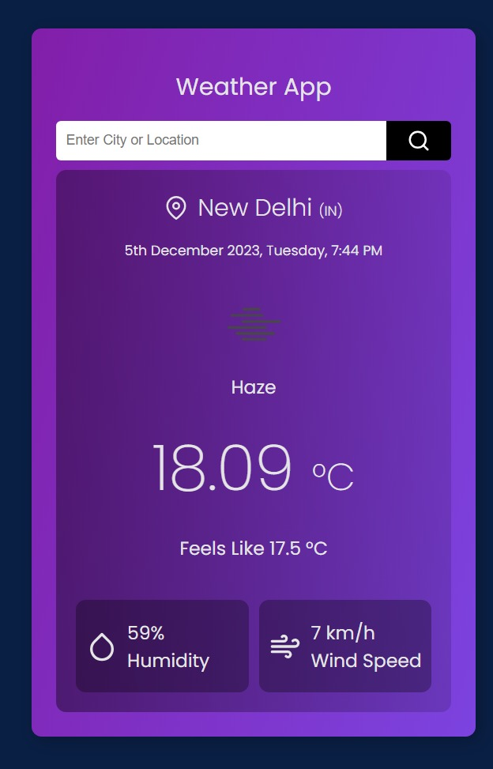

# Weather App React Project



A simple and responsive weather application built with ReactJS, utilizing React Hooks, and fetching data from the OpenWeatherMap API.

## Live Demo

You can view a live demo of the project [here](https://weatherappreact-project.netlify.app/).

## Getting Started

### Prerequisites

- Node.js and npm installed on your machine.

### Installation

1. Clone the repository:

```
git clone https://github.com/rahulkumar-yadav/weather-app-react-project.git
```

2. Navigate to the project directory:

```
cd weather-app-react-project
```

3. Install dependencies:

```
npm install
```

## Usage

1. Obtain an API key from OpenWeatherMap and replace 'YOUR_API_KEY' in the src/api/api.js file with your actual API key.

2. Start the development server:

```
npm start
```

3. Open your browser and visit http://localhost:3000 to view the app.

Thank you for checking out my project!
